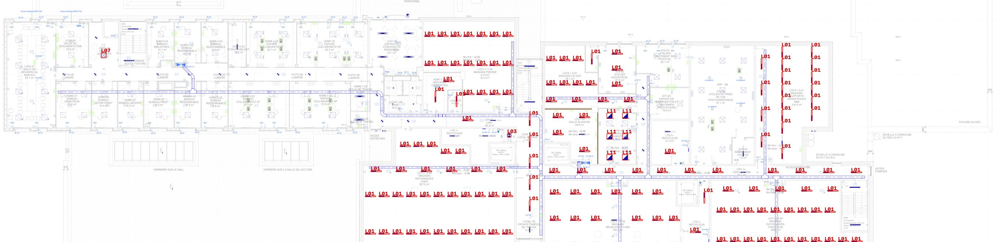
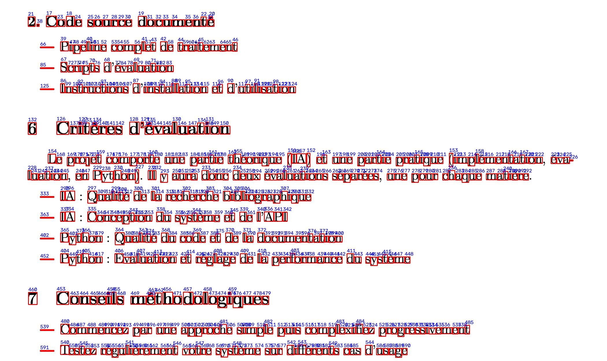
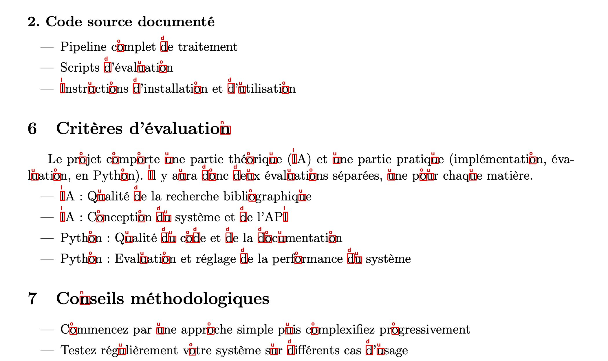

# AI-Reader

🇫🇷 Français · [🇬🇧 English](README.md)

Repérer et reconnaître des symboles dans de grandes images techniques : luminaires sur un plan de bâtiment et
caractères sur une page de texte. Deux approches sont construites et comparées sur les mêmes données : une base de
vision par ordinateur classique (template matching) et un petit CNN entraîné uniquement à partir du catalogue de
symboles. Réalisé avec OpenCV et PyTorch.



| Source | Image | Catalogue | Ce qu'on cherche |
|---|---|---|---|
| `plan` | plan d'un bâtiment (13 624 × 5 061 px) | 6 luminaires | les luminaires, quelle que soit leur orientation |
| `page` | page de texte (2 480 × 3 507 px) | 6 caractères | les caractères `2 I d n o u` |

## Résultats sur le plan

Évaluation par rapport à une vérité terrain de 185 luminaires relue à la main (`data/plans/verite_terrain.json`).

| Méthode | Précision | Rappel | F1 | Temps |
|---|---|---|---|---|
| Template matching | 1,00 | 0,98 | 0,99 | ~70 s |
| CNN | 0,97 | 0,92 | 0,95 | ~11 s |

Sur la moitié droite du plan seule (que le CNN n'a jamais vue) : template matching 1,00 / 0,98, CNN 0,97 / 0,90.

**Comment lire ces chiffres**
- La vérité terrain a été construite en réunissant les détections des deux méthodes puis en relisant à l'œil chaque
  désaccord. Elle est donc favorable au template matching par construction (toutes ses détections y figurent), et ce
  que *les deux* méthodes ratent n'est pas compté : le rappel est une borne haute.
- Le résultat intéressant est celui du CNN : il est entraîné **sans aucun luminaire du plan** (seulement les gabarits du
  catalogue augmentés et des zones sans luminaire de la moitié gauche du plan), et pourtant il atteint 97 % de
  précision, retrouve 4 barres que le template matching a ratées (en partie cachées par du texte) et va environ 6 fois
  plus vite.
- Ses erreurs sont connues : 14 barres manquées parce que la région candidate englobe aussi des traits bleus voisins, et
  5 faux positifs (3 symboles « M » avec arcs étiquetés `luminaire_10`, un smiley, une barre pleine foncée).
- `luminaire_10` et `luminaire_15` ne sont pas présents sur ce plan : ces classes ne sont donc pas vraiment testées.

## Méthode

1. **Segmentation** (`ai_reader/segmentation.py`) : binarisation (seuil fixe, moyenne ou gaussien) puis composantes
   connexes. Sur la page, elle encadre toutes les lettres, mais sans dire lesquelles :

   

2. **Template matching** (`ai_reader/recognition.py`) : corrélation normalisée de chaque symbole du catalogue, puis
   fusion des détections qui se recouvrent (le meilleur score gagne).
   - *Plan* : la corrélation est faite sur un masque « bleu pur » (`imaging.blue_mask`), car les symboles sont
     tracés en bleu alors que murs, cotes et mobilier sont gris ou noirs. Les gabarits sont testés à 0°, 90°, 180° et 270°.
   - *Page* : un gabarit très fin comme `I` corrèle fortement avec le fût de `P`, `L` ou `T`. On ne garde donc une
     détection que si la composante connexe située dessous a la taille du gabarit (à 15 % près).

   

3. **CNN** (`ai_reader/cnn.py`, plan uniquement) : les régions candidates sont les amas de pixels bleus du plan
   (`ai_reader/proposals.py`). Un réseau convolutif à 4 blocs (~130 k paramètres) classe chaque vignette 64×64 en l'un
   des 6 luminaires ou « autre ».
   - *Positifs* : uniquement les 6 gabarits du catalogue, augmentés (rotations de 90°, échelle, flou, bruit, traits
     parasites qui touchent le symbole, petites occlusions).
   - *Négatifs* : de vraies régions candidates de la moitié gauche du plan (luminaires connus exclus) et des
     régions synthétiques (fragments de gabarits, traits, cercles).
   - *Évaluation* : la moitié droite du plan est réservée pour les négatifs ; aucun luminaire du plan ne sert à l'entraînement.

Seuils : 0,90 sur la page, et sur le plan 0,85 par défaut, 0,75 pour `luminaire_07`, 0,80 pour `luminaire_11`, choisis en
inspectant visuellement tous les candidats avec un score ≥ 0,5. Ces seuils ont été réglés sur ce même plan, ce qui est une
raison de plus de lire les chiffres du template matching comme optimistes. Le CNN utilise le seuil par défaut (argmax, 0,5).

**Limites sur la page** : seuls les 6 caractères du catalogue sont cherchés, toutes les autres lettres sont ignorées par
construction. Le gabarit `n` est en gras et ne reconnaît que les `n` des titres, et les lettres qui se touchent ne
forment pas une composante de la bonne taille. Il n'y a pas de vérité terrain pour la page, ni de CNN dessus.

## Installation

Python 3.10 ou plus.

```bash
python -m venv .venv
source .venv/bin/activate        # Windows : .venv\Scripts\Activate.ps1
pip install -r requirements.txt
```

## Utilisation

```bash
python -m ai_reader detect page                          # template matching sur la page, ~3 s
python -m ai_reader detect plan                          # template matching sur le plan, ~1 min
python -m ai_reader detect plan --method cnn             # CNN sur le plan, ~10 s
python -m ai_reader train                                # réentraîne le CNN (~2 min sur CPU)
python -m ai_reader segment page --threshold gaussian --min-area 50

# précision / rappel par rapport à la vérité terrain (--x-min 6800 : moitié droite seulement)
python -m ai_reader evaluate resultats/plan_cnn_detections.json data/plans/verite_terrain.json
```

Les sorties (image annotée et JSON des détections) vont dans `resultats/` (ignoré par git). Pour chercher plus de
caractères, déposer des recadrages dans `data/caracteres/catalogue/` (par exemple `a.png`) : aucun changement de code.

## Tests

```bash
python -m pytest
```

## Organisation

```
ai_reader/
  imaging.py       chargement, seuils, masque bleu
  segmentation.py  composantes connexes
  recognition.py   template matching, NMS, détection plan / page
  proposals.py     régions candidates sur le plan
  cnn.py           données synthétiques, réseau, entraînement, détection
  evaluation.py    précision / rappel
  cli.py           ligne de commande
data/              plan, page, catalogues de gabarits, vérité terrain
models/            poids du CNN entraîné
docs/              images du README
tests/
```
